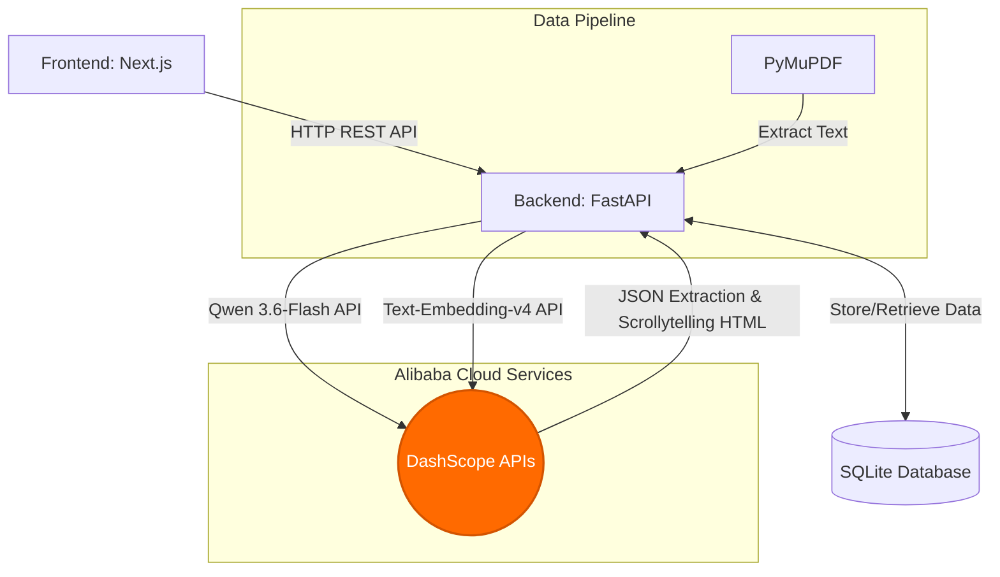

# MemScroll-AI

> **Qwen AI Hackathon 2026 Submission**


## What is MemScroll-AI? (Features & Functionality)

MemScroll-AI is an AI-powered research assistant designed to transform the way students and researchers consume academic literature. Instead of re-reading the same foundational concepts across multiple papers, MemScroll-AI builds a persistent memory graph of your reading history and generates adaptive, interactive "scrollytelling" narratives that focus only on what truly matters to you.

### Key Features:
- **Adaptive Reader**: Upload a PDF and read it as an interactive web page. The AI detects concepts you've mastered and automatically condenses them, saving you hours of reading time.
- **Persistent Memory Graph**: Every concept extracted is tracked in an SQLite database. The system remembers what you know (using vector embeddings) and automatically archives low-importance data.
- **Conflict Resolution (Synthesis)**: Automatically cross-reference new claims against your historical reading list and write synthesis notes seamlessly.
- **Scrollytelling Output**: Beautiful, magazine-style data visualization and narrative generation for methodology and findings, directly generated in HTML/CSS by the Qwen LLM.

## Proof of Alibaba Cloud Deployment & Usage

MemScroll-AI is actively deployed on Alibaba Cloud and leverages DashScope APIs for its core intelligence.

1. **Alibaba Cloud ECS Deployment**: 
   The FastAPI backend is deployed on an Alibaba Cloud ECS instance. You can interact with the live backend API here: `https://memscroll-api.duckdns.org/docs`
2. **Qwen Models Used**:
   - `qwen3.7-plus` for Concept Extraction & Complex Analysis
   - `qwen3.6-flash` for Fast HTML/CSS Scrollytelling Generation
   - `text-embedding-v4` for Semantic Vector Search
3. **Code Proof**: 
   Please see [`backend/pipeline.py`](https://github.com/fhmi-kzkf/MemScroll-AI/blob/main/backend/pipeline.py) which contains the explicit integration and HTTP calls to `https://dashscope-intl.aliyuncs.com`.

## Tech Stack

### Frontend
- **Framework**: [Next.js](https://nextjs.org/) (React)
- **Styling**: Tailwind CSS
- **Animations**: Framer Motion
- **Icons**: Lucide React
- **Language**: TypeScript

### Backend
- **Framework**: [FastAPI](https://fastapi.tiangolo.com/)
- **Database**: SQLite (SQLAlchemy ORM)
- **AI Models**: Qwen 3.6-Flash & Text-Embedding-v4 (via Dashscope API)
- **PDF Processing**: PyMuPDF (fitz)

## Prerequisites

- Node.js (v18+)
- Python (v3.9+)
- A Dashscope / Qwen API Key

## Getting Started

### 1. Clone the repository
```bash
git clone https://github.com/your-username/MemscrollAI.git
cd MemscrollAI
```

### 2. Set up the Backend
Navigate to the backend directory, set up your virtual environment, and install the dependencies.

```bash
cd backend
python -m venv venv
# Windows: venv\Scripts\activate
# Mac/Linux: source venv/bin/activate
pip install -r requirements.txt
```

Create a `.env` file in the `backend` directory and add your Qwen API key:
```env
QWEN_API_KEY=your_qwen_api_key_here
```

Start the FastAPI server:
```bash
uvicorn main:app --host 0.0.0.0 --port 8000 --reload
```
The backend API will run on `http://localhost:8000`.

### 3. Set up the Frontend
Open a new terminal window, navigate to the frontend directory, and install dependencies.

```bash
cd frontend
npm install
```

Start the Next.js development server:
```bash
npm run dev
```
The application will be accessible at `http://localhost:3000`.

## Architecture & Pipeline

When a paper is uploaded, it goes through a 4-stage pipeline:
1. **Extract**: Text is extracted from the PDF using PyMuPDF.
2. **Analyze**: The text is sent to the Qwen LLM to extract key concepts, importance scores, methodology, and findings.
3. **Embed**: Concepts are embedded into vector representations for the memory graph.
4. **Generate**: The LLM writes HTML-based "Scrollytelling" sections complete with visual data representations (SVG/CSS charts).

### System Architecture Diagram



## Proof of Alibaba Cloud Usage

MemscrollAI leverages **Alibaba Cloud's DashScope API** to power its core intelligence, specifically utilizing the `qwen3.6-flash`, `qwen3.7-plus`, and `text-embedding-v4` models.

You can verify the integration in the source code here:
- [`backend/pipeline.py`](https://github.com/fhmi-kzkf/MemScroll-AI/blob/main/backend/pipeline.py) - See functions `extract_concepts()`, `embed_concept()`, and `generate_scrollytelling()` which make direct HTTP calls to `https://dashscope-intl.aliyuncs.com`.
- [`backend/main.py`](https://github.com/fhmi-kzkf/MemScroll-AI/blob/main/backend/main.py) - See the API routes configured to securely handle Qwen API interactions.

## License
MIT License. See `LICENSE` for more information.
